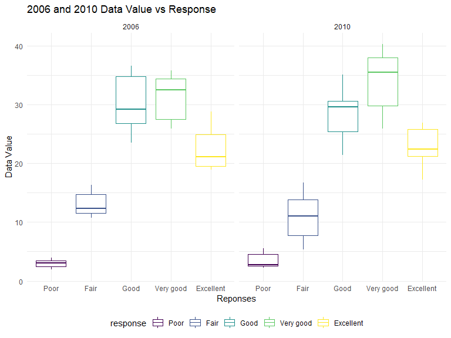
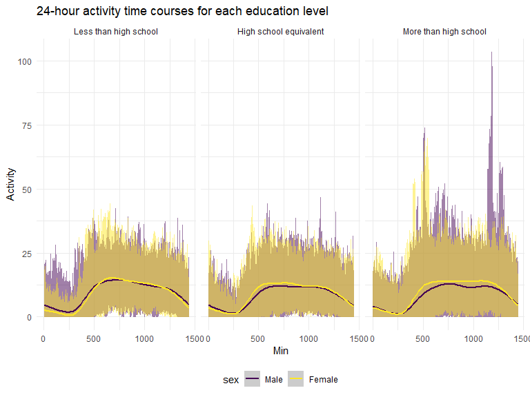

P8105_hw3_yy3295
================
Ye Yuan
2023-10-14

# Problem 1

Read in the data

``` r
data("instacart")

instacart = 
  instacart |> 
  as_tibble()
```

Answer questions about the data

This dataset contains 1384617 rows and 15 columns, with each row
resprenting a single product from an instacart order. Variables include
identifiers for user, order, and product; the order in which each
product was added to the cart. There are several order-level variables,
describing the day and time of the order, and number of days since prior
order. Then there are several item-specific variables, describing the
product name (e.g. Yogurt, Avocado), department (e.g. dairy and eggs,
produce), and aisle (e.g. yogurt, fresh fruits), and whether the item
has been ordered by this user in the past. In total, there are 39123
products found in 131209 orders from 131209 distinct users.

Below is a table summarizing the number of items ordered from aisle. In
total, there are 134 aisles, with fresh vegetables and fresh fruits
holding the most items ordered by far.

``` r
instacart |> 
  count(aisle) |> 
  arrange(desc(n))
```

    ## # A tibble: 134 × 2
    ##    aisle                              n
    ##    <chr>                          <int>
    ##  1 fresh vegetables              150609
    ##  2 fresh fruits                  150473
    ##  3 packaged vegetables fruits     78493
    ##  4 yogurt                         55240
    ##  5 packaged cheese                41699
    ##  6 water seltzer sparkling water  36617
    ##  7 milk                           32644
    ##  8 chips pretzels                 31269
    ##  9 soy lactosefree                26240
    ## 10 bread                          23635
    ## # ℹ 124 more rows

Next is a plot that shows the number of items ordered in each aisle.
Here, aisles are ordered by ascending number of items.

``` r
instacart |> 
  count(aisle) |> 
  filter(n > 10000) |> 
  mutate(aisle = fct_reorder(aisle, n)) |> 
  ggplot(aes(x = aisle, y = n)) + 
  geom_point() + 
  labs(title = "Number of items ordered in each aisle") +
  theme(axis.text.x = element_text(angle = 60, hjust = 1))
```


Our next table shows the three most popular items in aisles
`baking ingredients`, `dog food care`, and `packaged vegetables fruits`,
and includes the number of times each item is ordered in your table.

``` r
instacart |> 
  filter(aisle %in% c("baking ingredients", "dog food care", "packaged vegetables fruits")) |>
  group_by(aisle) |> 
  count(product_name) |> 
  mutate(rank = min_rank(desc(n))) |> 
  filter(rank < 4) |> 
  arrange(desc(n)) |>
  knitr::kable()
```

| aisle                      | product_name                                  |    n | rank |
|:---------------------------|:----------------------------------------------|-----:|-----:|
| packaged vegetables fruits | Organic Baby Spinach                          | 9784 |    1 |
| packaged vegetables fruits | Organic Raspberries                           | 5546 |    2 |
| packaged vegetables fruits | Organic Blueberries                           | 4966 |    3 |
| baking ingredients         | Light Brown Sugar                             |  499 |    1 |
| baking ingredients         | Pure Baking Soda                              |  387 |    2 |
| baking ingredients         | Cane Sugar                                    |  336 |    3 |
| dog food care              | Snack Sticks Chicken & Rice Recipe Dog Treats |   30 |    1 |
| dog food care              | Organix Chicken & Brown Rice Recipe           |   28 |    2 |
| dog food care              | Small Dog Biscuits                            |   26 |    3 |

Finally is a table showing the mean hour of the day at which Pink Lady
Apples and Coffee Ice Cream are ordered on each day of the week. This
table has been formatted in an untidy manner for human readers. Pink
Lady Apples are generally purchased slightly earlier in the day than
Coffee Ice Cream, with the exception of day 5.

``` r
instacart |>
  filter(product_name %in% c("Pink Lady Apples", "Coffee Ice Cream")) |>
  group_by(product_name, order_dow) |>
  summarize(mean_hour = mean(order_hour_of_day)) |>
  pivot_wider(
    names_from = order_dow, 
    values_from = mean_hour) |>
  knitr::kable(digits = 2)
```

    ## `summarise()` has grouped output by 'product_name'. You can override using the
    ## `.groups` argument.

| product_name     |     0 |     1 |     2 |     3 |     4 |     5 |     6 |
|:-----------------|------:|------:|------:|------:|------:|------:|------:|
| Coffee Ice Cream | 13.77 | 14.32 | 15.38 | 15.32 | 15.22 | 12.26 | 13.83 |
| Pink Lady Apples | 13.44 | 11.36 | 11.70 | 14.25 | 11.55 | 12.78 | 11.94 |

\#Problem 2 Load the data

``` r
data("brfss_smart2010")
```

Data cleaning - format the data to use appropriate variable names -
focus on the “Overall Health” topic - include only response from
“Excellent” to “Poor” - organize responses as a factor taking levels
ordered from “Poor” to “Excellent”

``` r
brfss_df <-
  brfss_smart2010 |>
  rename(State = Locationabbr, Location = Locationdesc) |>
  janitor::clean_names() |>
  filter(topic == "Overall Health", response %in% c("Poor", "Fair", "Good", "Very Good", "Excellent")) |>
  mutate(response = factor(response, levels = c("Poor", "Fair", "Good", "Very good", "Excellent"), ordered = TRUE))
```

In 2002, which states were observed at 7 or more locations? What about
in 2010?

``` r
brfss_df |>
  filter(year == 2002) |>
  group_by(state) |>
  summarise(location_number = n_distinct(location)) |>
  filter(location_number >= 7)
```

    ## # A tibble: 6 × 2
    ##   state location_number
    ##   <chr>           <int>
    ## 1 CT                  7
    ## 2 FL                  7
    ## 3 MA                  8
    ## 4 NC                  7
    ## 5 NJ                  8
    ## 6 PA                 10

``` r
brfss_df |>
  filter(year == 2010) |>
  group_by(state) |>
  summarise(location_number = n_distinct(location)) |>
  filter(location_number >= 7)
```

    ## # A tibble: 14 × 2
    ##    state location_number
    ##    <chr>           <int>
    ##  1 CA                 12
    ##  2 CO                  7
    ##  3 FL                 41
    ##  4 MA                  9
    ##  5 MD                 12
    ##  6 NC                 12
    ##  7 NE                 10
    ##  8 NJ                 19
    ##  9 NY                  9
    ## 10 OH                  8
    ## 11 PA                  7
    ## 12 SC                  7
    ## 13 TX                 16
    ## 14 WA                 10

In 2002, CT, FL, MA, NC, NJ, PA (6 states) were observed at 7 or more
locations. In 2010, CA, CO, FL, MA, MD, NC, NE, NJ, NY, OH, PA, SC, TX,
WA (14 states) were observed at 7 or more locations.

Construct a dataset that is limited to Excellent responses, and
contains, year, state, and a variable that averages the data_value
across locations within a state. Make a “spaghetti” plot of this average
value over time within a state.

``` r
brfss_df_new <-
  brfss_df |>
  filter(response == "Excellent") |>
  group_by(year, state) |>
  summarise(mean_data_value = mean(data_value))
```

    ## `summarise()` has grouped output by 'year'. You can override using the
    ## `.groups` argument.

``` r
brfss_df_new |>
  ggplot(aes(y = mean_data_value, 
             x = year, 
             color = state)) +
  geom_line(alpha = 0.7) +
  geom_point(alpha = 0.3) +
  labs(x = "Year", 
       y = "Mean Data Value", 
       title = "Average Value Over Time Within State")
```


From this plot we

Make a two-panel plot showing, for the years 2006, and 2010,
distribution of data_value for responses (“Poor” to “Excellent”) among
locations in NY State.

``` r
brfss_df |>
  filter(state == "NY", year %in% c(2006, 2010)) |>
  ggplot(aes(y = data_value, 
             x = response, 
             color = response)) +
  geom_boxplot() +
  facet_wrap(~year) +
  labs(x = "Reponses", 
       y = "Data Value",
       title = "2006 and 2010 Data Value vs Response")
```



\#Problem 3 Load the data.

``` r
nhanes_accel <- read.csv(file = "./data/nhanes_accel.csv") |>
  janitor::clean_names() |>
  drop_na()

nhanes_covar <- read.csv(file = "./data/nhanes_covar.csv", skip = 4) |>
  janitor::clean_names() |>
  drop_na() |>
  filter(age >= 21)
```

Tidy, merge and organize the data sets

``` r
nhanes_merge <- inner_join(nhanes_covar, nhanes_accel,
                           by = "seqn")

nhanes_merge$sex <- factor(nhanes_merge$sex, 
                           levels = c("1", "2"),
                           labels = c("Male", "Female"))
nhanes_merge$education <- factor(nhanes_merge$education,
                                 levels = c("1", "2", "3"),
                                 labels = c("Less than high school", "High school equivalent", "More than high school"))

nhanes_merge$age <- as.integer(nhanes_merge$age)
```

Produce a reader-friendly table for the number of men and women in each
education category, and create a visualization of the age distributions
for men and women in each education category.

``` r
nhanes_merge |>
  group_by(sex, education) |>
  summarise(count = n()) |>
  pivot_wider(names_from = education,
              values_from = count) |>
  knitr::kable()
```

    ## `summarise()` has grouped output by 'sex'. You can override using the `.groups`
    ## argument.

| sex    | Less than high school | High school equivalent | More than high school |
|:-------|----------------------:|-----------------------:|----------------------:|
| Male   |                    27 |                     35 |                    56 |
| Female |                    28 |                     23 |                    59 |

``` r
nhanes_merge |>
  ggplot(aes(x = education,
             y = age,
             fill = sex)) +
  geom_boxplot() +
  labs(x = "Education Category",
       y = "Age",
       title = "Age Distributions for men and women in eaxh education category",)
```


From the table for the number of men and women in each education
category, we can learn that there are 27 males and 28 females whose
education level is less than high school, there are 35 males and 23
females whose education level is high school equivalent, there are 56
males and 59 females whose education level is more than high school.

From the plot for age distributions for men and women in each education
category, we can learn that for males and females with education
category of less than high school and more than high school, their age
distribution has no significant difference. For males and females with
education category of high school equivalent, the age distribution of
males are younger than females.

Using your tidied dataset, aggregate across minutes to create a total
activity variable for each participant. Plot these total activities
(y-axis) against age (x-axis); your plot should compare men to women and
have separate panels for each education level. Include a trend line or a
smooth to illustrate differences.

``` r
nhanes_merge_0 <- nhanes_merge |>
  mutate(ta = rowSums(across(min1:min1440)))

ggplot(nhanes_merge_0, aes(x = age,
                           y = ta,
                           color = sex)) +
  geom_point() +
  geom_smooth(method = lm) +
  facet_grid(~education) +
  labs(x = "age",
       y = "total_activity",
       title = "Total activities against Age") 
```

    ## `geom_smooth()` using formula = 'y ~ x'


From the plot of total activities vs age, we can learn that there is
negative association between total activities and ages for the three
education categories. For high school or equivalent and more than high
school groups, females tend to have higher total activities than males.
For less than high school group, females and males tends to have similar
trends, however, as age increases, the total activities decrease at a
higher rate when compared to other groups.

Accelerator data allows the inspection activity over the course of the
day. Make a three-panel plot that shows the 24-hour activity time
courses for each education level and use color to indicate sex.

``` r
nhanes_merge_1 <- nhanes_merge |>
  pivot_longer(cols = starts_with("min"),
               names_to = "min",
               values_to = "activity") |>
  mutate(min = as.integer(gsub("min", "", min)))

nhanes_merge_1 |>
  ggplot(aes(x = min,
             y = activity,
             color = sex)) +
  geom_line(alpha = 0.5) +
  geom_smooth() +
  facet_wrap(~education) +
  labs(x = "Min",
       y = "Activity",
       title = "24-hour activity time courses for each education level",)
```

    ## `geom_smooth()` using method = 'gam' and formula = 'y ~ s(x, bs = "cs")'


From the plot of 24-hour activity time courses for each category level,
we can learn that there is no significant difference of 24-hour activity
time courses between all three education categories.
